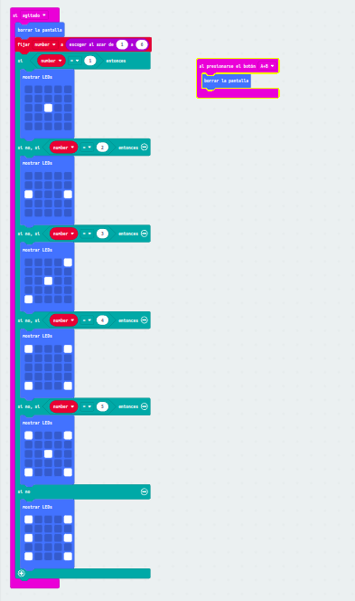

## Mi proyecto

- Mi proyecto es algo muy simple, es un dado

- Este dado tiene dos entradas una al agitar que llama a una variable para darle un valor al azar del 1 al 6
y luego dependiendo del valor que le de este pregunta que si es 1 ,2 ,3 ,4 ,5 o 6 que muestre una imagen por pantalla
y sin olvidarnos que primero borre la pantalla.

- Y la segunda entarda es solo para borrar la pantalla en caso de que ya no quieras usarlo más.
